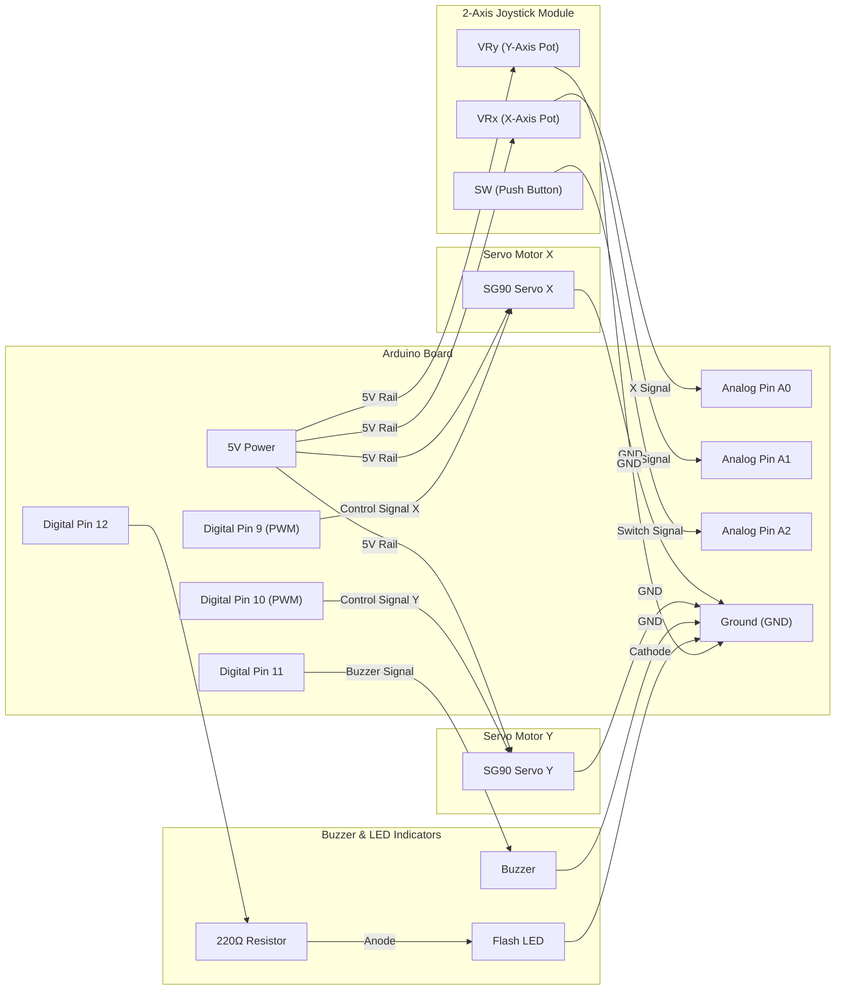

# Dual Servo Control with 2-Axis Joystick, Buzzer & LED Indicator

An Arduino project that controls two Servo Motors (X-axis and Y-axis) dynamically using a 2-Axis Analog Joystick module. The system features boundary alerts via an active/passive **Buzzer** when either servo hits its mechanical limit ($0^\circ$ or $180^\circ$) and a visual **LED indicator** that flashes when the joystick pushbutton is pressed.

---

## 📌 Features

- **2-Axis Proportional Control**: Increments or decrements servo positions (X and Y) based on joystick analog readings.
- **Deadzone Filtering**: Ignores small joystick fluctuations around the resting center position ($510–520$).
- **Boundary Limit Warning**: Triggers a 200 ms audible beep on Pin 11 when either servo reaches $0^\circ$ (min) or $180^\circ$ (max).
- **Pushbutton Flash Alert**: Detects joystick pushbutton presses (SW pin) to illuminate an LED on Pin 12 for 1 second.
- **Real-Time Serial Monitoring**: Streams live analog joystick values, button status, and current servo angles over Serial at 9600 baud.

---

## 🛠️ Bill of Materials (BOM)

| Component | Quantity | Description |
| :--- | :---: | :--- |
| **Arduino Microcontroller** | 1 | Arduino Uno R3, Nano, or Mega |
| **Servo Motors** | 2 | Micro Servo Motors (e.g., SG90 or MG90S) for X and Y axes |
| **2-Axis Joystick Module** | 1 | Dual potentiometer joystick with integrated push-button (VRx, VRy, SW) |
| **Buzzer** | 1 | 5V Active or Passive Piezo Buzzer |
| **LED** | 1 | Standard 5mm LED (Red, Green, or Yellow) |
| **220 Ω - 330 Ω Resistor** | 1 | Current-limiting resistor for LED anode |
| **Breadboard & Jumper Wires** | 1 | Standard breadboard and M/M jumper wires |
| **Power Supply / USB Cable** | 1 | USB cable or external 5V supply for servos |

---

## ⚡ Pin Connections

| Arduino Pin | Connected Component | Details / Notes |
| :--- | :--- | :--- |
| **5V** | Joystick VCC, Servo X VCC, Servo Y VCC | Power (+5V Rail) |
| **GND** | Joystick GND, Servo X GND, Servo Y GND, Buzzer (-), LED Cathode | Ground reference |
| **A0 (Analog)** | Joystick **VRx** Pin | Reads X-axis analog position ($0–1023$) |
| **A1 (Analog)** | Joystick **VRy** Pin | Reads Y-axis analog position ($0–1023$) |
| **A2 (Analog)** | Joystick **SW** (Button Switch) Pin | Reads pushbutton switch state ($0$ when pressed) |
| **Pin 9 (PWM)** | Servo X Signal (Orange/Yellow wire) | PWM signal for X-axis position control |
| **Pin 10 (PWM)** | Servo Y Signal (Orange/Yellow wire) | PWM signal for Y-axis position control |
| **Pin 11 (Digital)**| Buzzer Anode (+) | Audio output signal for boundary alert |
| **Pin 12 (Digital)**| LED Anode (+) via 220Ω resistor | Visual output signal for button press indicator |

---

## 🔌 Circuit Diagrams

### 1. Mermaid Flowchart Diagram



### 2. Schematics Representation

```
                    +--------------------------------+
                    |          ARDUINO UNO           |
                    |                                |
   +5V Rail --------| 5V                             |
   GND Rail --------| GND                            |
                    |                                |
  Joystick VRx ---->| A0                             |
  Joystick VRy ---->| A1                             |
  Joystick SW  ---->| A2                             |
                    |                                |
                    | Pin 9  (PWM) ----> Servo X Sig |
                    | Pin 10 (PWM) ----> Servo Y Sig |
                    | Pin 11       ----> Buzzer (+)  |
                    | Pin 12       ----> [220Ω] ----> LED (+)
                    +--------------------------------+
```

---

## 🕹️ System Operation & Threshold Mapping

| Parameter / Input | Threshold Condition | System Action |
| :--- | :--- | :--- |
| **Joystick Center (Idle)** | $510 \le V_{analog} \le 520$ | Servos hold current position (deadzone area) |
| **Joystick X Left** | $VRx < 510$ | Decrements X angle by $5^\circ$ per step |
| **Joystick X Right** | $VRx > 520$ | Increments X angle by $5^\circ$ per step |
| **Joystick Y Down** | $VRy < 510$ | Decrements Y angle by $5^\circ$ per step |
| **Joystick Y Up** | $VRy > 520$ | Increments Y angle by $5^\circ$ per step |
| **X or Y Axis Min Limit** | Angle $\le 0^\circ$ | Clamps angle to $0^\circ$ and triggers 200 ms Buzzer alert |
| **X or Y Axis Max Limit** | Angle $\ge 180^\circ$ | Clamps angle to $180^\circ$ and triggers 200 ms Buzzer alert |
| **Joystick Pushbutton** | $SW == 0$ (pressed) | Flashes LED on Pin 12 HIGH for 1000 ms |

---

## 🧠 Code Structure & Logic

1. **Initialization (`setup`)**:
   - Initializes Serial communication at `9600` baud.
   - Configures output pins for Buzzer (`11`) and LED (`12`).
   - Attaches Servo X to Pin `9` and Servo Y to Pin `10`, resetting both angles to initial position `0°`.

2. **Joystick Movement & Deadzone Evaluation**:
   ```cpp
   if (tempServoxVal < 510) {
     if (servoxVal <= 0) {
       buzz();
       servoxVal = 0;
     } else {
       servoxVal = servoxVal - 5;
     }
   } else if (tempServoxVal > 520) {
     if (servoxVal >= 180) {
       buzz();
       servoxVal = 180;
     } else {
       servoxVal = servoxVal + 5;
     }
   }
   ```

3. **Button Press Detection**:
   ```cpp
   int switchReadVal = analogRead(switchPin);
   if (switchReadVal == 0) {
     flash(); // Turns LED ON for 1000 ms then OFF
   }
   ```

4. **Alert Helper Functions**:
   - `buzz()`: Pulsed active state on Pin 11 for 200 ms.
   - `flash()`: Active state on Pin 12 for 1000 ms.

---

## 🚀 How to Run

1. Wire all components according to the [Pin Connections](#-pin-connections) table and [Circuit Diagrams](#-circuit-diagrams).
2. Connect your Arduino board to your PC via USB.
3. Open [`moving-servos-with-joystick.ino`](moving-servos-with-joystick.ino) in the **Arduino IDE**.
4. Ensure the `<Servo.h>` library is available (built-in with Arduino IDE).
5. Select your target **Board** (e.g., *Arduino Uno*) and **Port** under `Tools`.
6. Click **Upload** ($\rightarrow$).
7. Open the **Serial Monitor** at **9600 baud** to view real-time joystick positions, switch state, and updated servo angles.
